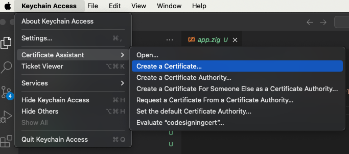
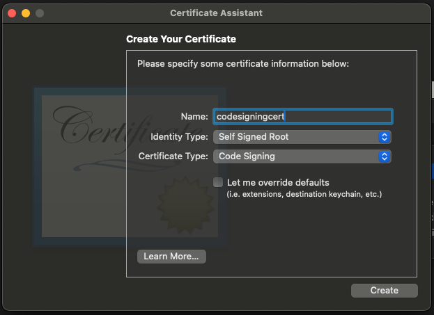
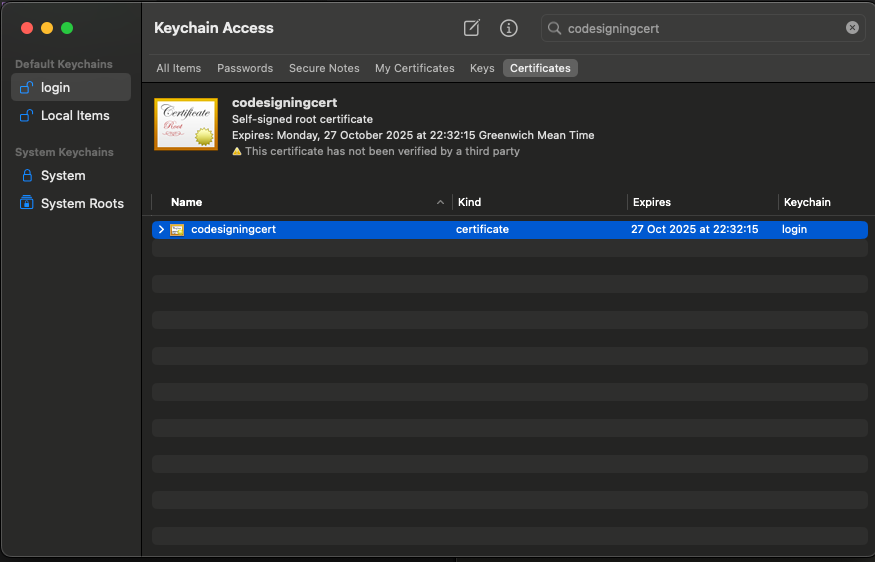

Zig binary crashes after code signing on MacOS ([issue](https://github.com/ziglang/zig/issues/21835)).

### Steps to reproduce
1. Provision a code signing certificate ([see](#how-to-provision-code-signing-cert))
2. Build `app` binary
    ```
    $ make build
    ```
3. Run `app`
    ```
    $ ./app
    Hello, World!
    ```
4. Sign `app` binary
    ```
    $ make sign
    ```
5. Verify the binary
    ```
    $ make verify
    app: valid on disk
    app: satisfies its Designated Requirement
    ```
6. Run signed `app` binary:
    ```
    $ ./app
    segmentation fault  ./app
    ```
    or:
    ```
    $ ./app
    bus error  ./app
    ```
    Expected:
    ```
    $ ./app
    Hello, World!
    ```

### Environment
```
$ make env
Zig version: 0.13.0

OS:
ProductName:            macOS
ProductVersion:         14.6.1
BuildVersion:           23G93

CPU:
Intel(R) Core(TM) i7-9750H CPU @ 2.60GHz
x86_64
```

### How to provision code signing cert
1. Run "Keychain Access > Certificate Assistant > Create a Certificate..."
    
2. Create a code signing certificate
    
3. Check the certificate
    
